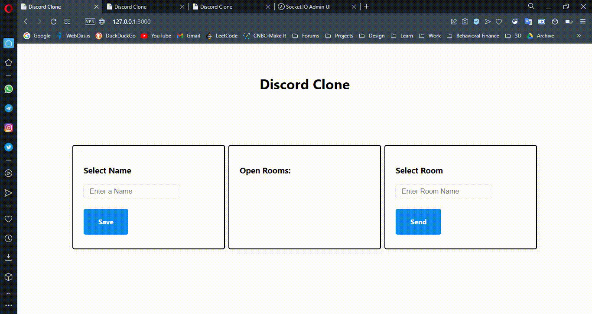

# Discord-Clone-with-Socket.IO

### Built with

    - Vanilla-Javascript
    - Express
    - Socket.IO
    - Pug
    - NodeJS

### Demo

### Setup

    - git clone https://github.com/Hardly-Human/Discord-Clone-with-Socket.IO.git
    - npm install
    - npm run dev

### Socket.IO Admin UI Dashboard - [[@socket.io/admin-ui docs](https://socket.io/docs/v4/admin-ui/)]

    - Go to admin.socket.io/#/
